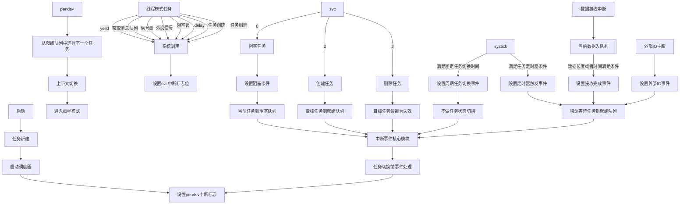

```mermaid
graph TD
    启动
    --> 任务新建
    --> 启动调度器
    --> 设置pendsv中断标志
    pendsv
    -->从就绪队列中选择下一个任务
    -->上下文切换
    -->进入线程模式
    A[线程模式任务]

    A-->|yeild|B[系统调用]
    A-->|获取消息队列|B
    A-->|信号量|B
    A-->|外设信号|B
    A-->|阻塞锁|B
    A-->|delay|B
    A-->|任务创建|B
    A-->|任务删除|B

    B-->设置svc中断标志位

    %%B -->系统调用
    svc-->|0|阻塞任务-->设置阻塞条件-->当前任务到阻塞队列-->C[中断事件核心模块]
    %%svc-->|1|唤醒任务-->就绪队列-->C
    svc-->|2|创建任务-->目标任务到就绪队列-->C
    svc-->|3|删除任务-->目标任务设置为失效-->C

 
    systick-->|满足任务定时器条件|设置定时器触发事件-->唤醒等待任务到就绪队列
    systick-->|满足固定任务切换时间|设置周期任务切换事件-->不做任务状态切换
    -->C
    -->任务切换前事件处理
    -->设置pendsv中断标志

    数据接收中断
    -->当前数据入队列
    --> |数据长度或者时间满足条件|设置接收完成事件 -->唤醒等待任务到就绪队列

    外部IO中断
    -->设置外部IO事件
    -->唤醒等待任务到就绪队列
    -->C


    
```